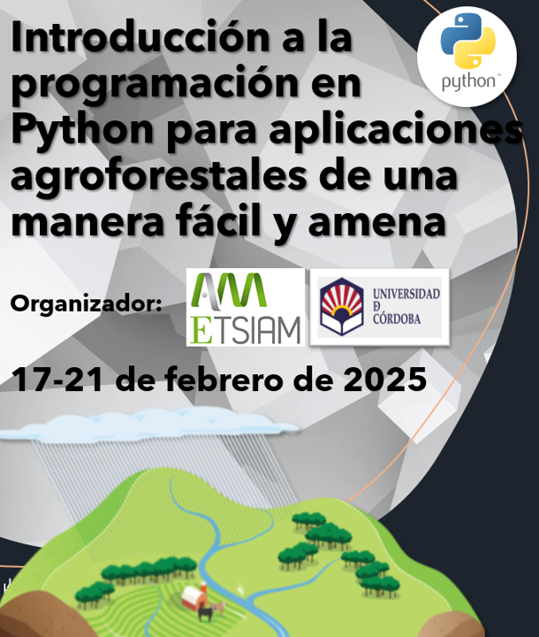

El objetivo del curso es la crear una primera inmersión a la programación en Python y explicar conceptos y funciones básicas de una manera amena y accesible a alumnos sin conocimientos previos en programación. Además, este curso pretende mostrar a los alumnos la utilidad de la programación en Python, y como sabiendo unos pocos conceptos básicos pueden mejorar mucho la calidad y eficiencia de su trabajo durante sus estudios universitarios en carreras agroforestales. Todo ello intentando que el alumno perciba la programación como algo fácil y accesible.

